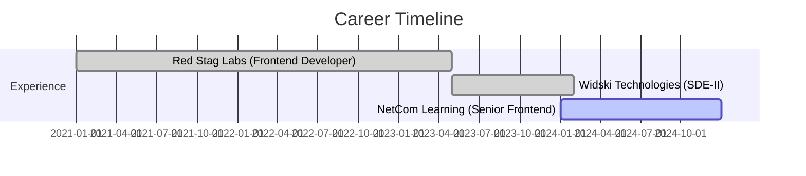

# 🚀 Basit Bilal Channa

<div align="center">
  
</div>

<p align="center">
  
</p>

<div align="center">
  
[](https://basit.dev)
[](mailto:bbchanna@gmail.com)
[](https://linkedin.com/in/basitchanna)
[](tel:+917006976393)
[](https://github.com/basitbc)

</div>

---

## 🌟 Professional Summary

```typescript
const BasitChanna = {
    role: "Senior Full Stack Developer",
    experience: "4+ Years",
    specialization: ["MERN Stack", "Microservices", "Team Leadership"],
    achievements: {
        applications_delivered: "50+",
        client_satisfaction: "95%",
        team_size_managed: "8+ developers",
        uptime_achieved: "99.9%",
        daily_api_requests: "50,000+"
    },
    current_focus: ["Digital Transformation", "Enterprise Solutions", "Performance Optimization"]
};
```

Results-driven Full Stack MERN Developer with proven track record of building scalable web applications using React.js, Node.js, Express.js, and MongoDB. Expert in RESTful API development, microservices architecture, and cloud deployment (AWS/Azure). Experienced team lead managing multicultural teams in Agile environments, driving digital transformation initiatives with 95% client satisfaction rate.

---

## 💻 Tech Arsenal

<div align="center">

### 🎯 Frontend Mastery


### ⚡ Backend Excellence


### 🗄️ Database & Storage


### ☁️ Cloud & DevOps


### 🎨 UI/UX & Styling


### 🛠️ Development Tools


</div>

---

## 💼 Professional Experience

<div align="center">



</div>

### 🎯 NetCom Learning - Senior Frontend Developer
**Jan 2024 – Present**

- 🏗️ **Enterprise Architecture**: Built scalable MERN stack solutions serving 100,000+ users with 99.9% uptime
- 👥 **Team Leadership**: Led cross-functional team of 8 developers from 5 nationalities using Agile methodologies
- 📈 **Performance Optimization**: Achieved 40% faster load times and 25% increase in user retention through React.js optimization
- 🚀 **API Development**: Developed RESTful APIs handling 50,000+ daily requests with JWT authentication and rate limiting
- 📊 **Impact**: 30% productivity improvement and 50% faster sprint velocity

### ⚡ Widski Technologies - Frontend Developer (SDE-II)
**May 2023 – Jan 2024**

- 🔄 **System Migration**: Migrated monolithic application to microservices architecture with 50+ RESTful APIs
- 🌐 **Enterprise Solutions**: Built management system using React.js with Next.js SSR, improving SEO rankings by 60%
- 🗄️ **Database Optimization**: Optimized MongoDB performance, reducing query response times from 2.5s to 300ms
- 🎯 **Core Web Vitals**: Achieved 95+ Lighthouse scores through advanced optimization techniques

### 🚀 Red Stag Labs - Frontend Software Developer
**Jan 2021 – Apr 2023**

- 🏆 **Portfolio Development**: Delivered 20+ full-stack MERN applications across e-commerce, fintech, and healthcare
- 📱 **Responsive Design**: Created mobile-first designs achieving 95+ Google Lighthouse scores
- ⚡ **Scalable Backend**: Built Node.js backends handling 100,000+ daily API calls with Redis caching
- 🐳 **Cloud Deployment**: Deployed applications using Docker and Kubernetes across multiple cloud regions

---

## 🚀 Featured Projects

### 🏆 AI CERTS365 - Blockchain Certificate Platform
[](https://github.com/basitbc)
[](https://basit.dev)

**🎯 Enterprise-grade blockchain certificate generation platform serving educational institutions**

**Tech Stack:** Node.js, Next.js, Express.js, MongoDB, Blockchain, Docker, Nginx, Azure

**⚡ Key Achievements:**
- 🔐 **Blockchain Security**: Smart contracts ensuring 100% document authenticity
- 📊 **Enterprise Scale**: Serving 50+ educational institutions with 100,000+ certificates issued
- 🚀 **High Performance**: Processing 10,000+ daily API requests with robust architecture
- 🌍 **Global Optimization**: CDN implementation reducing latency by 70% across GCC regions
- 🐳 **DevOps Excellence**: Docker containerization ensuring consistent deployment environments

---

### 🤖 Marvel Minds - AI-Powered Job Portal
[](https://github.com/basitbc)
[](https://basit.dev)

**🎯 Comprehensive AI-powered job matching platform with machine learning**

**Tech Stack:** Node.js, React.js, MongoDB, Machine Learning, Elasticsearch

**📈 Platform Metrics:**
- 👥 **50,000+ Active Users** across job seekers and employers
- 🔍 **1M+ Job Listings** with sub-second Elasticsearch queries
- 🎯 **85% Match Accuracy** through ML recommendation engine
- 💰 **AED 500K+ Monthly Revenue** from premium features
- 🌐 **Multilingual Support**: Full Arabic and English localization

---

### 🎬 AI Audio & Avatar Video Generator
[](https://github.com/basitbc)
[](https://basit.dev)

**🎯 Advanced multimedia platform with AI voice synthesis and avatar animation**

**Tech Stack:** Node.js, React.js, Python, AWS Lambda, WebRTC, FFmpeg

**🚀 Technical Achievements:**
- 🎙️ **AI Voice Synthesis**: Real-time high-quality voice generation with multiple accents
- 📹 **Avatar Animation**: Lifelike character animation synchronized with audio
- ☁️ **Serverless Architecture**: AWS Lambda reducing operational costs by 60%
- ⚡ **Concurrent Processing**: Handling 1,000+ video generation requests simultaneously
- 📊 **Real-time Analytics**: WebSocket connections for live progress tracking

---

## 🏆 Key Achievements & Metrics

<div align="center">

| Achievement | Impact | Technology |
|-------------|---------|------------|
| 🎯 **50+ Applications Delivered** | 95% Client Satisfaction | MERN Stack |
| 👥 **8+ Developers Led** | 5 Different Nationalities | Agile/Scrum |
| ⚡ **99.9% Uptime Achieved** | 100,000+ Users Served | Cloud Infrastructure |
| 📊 **50,000+ Daily API Requests** | Enterprise Scale Performance | Node.js/Express |
| 🔄 **Monolithic → Microservices** | 50+ RESTful APIs Developed | Architecture Design |
| 🌍 **70% Latency Reduction** | Global Performance Optimization | CDN Implementation |

</div>

---

## 🎓 Education

<div align="center">

**🎓 Bachelor of Engineering** - University of Mumbai (2019)  
*CGPA: 7.79/10*

**📚 Key Strengths:**
- Mathematical Principles & Data Analysis
- Project Management & Team Leadership
- Multidisciplinary Engineering Projects

</div>

---

## 🌐 Languages & Communication

<div align="center">


</div>

---

## 📈 GitHub Analytics

<div align="center">


</div>

---

## 📫 Let's Connect & Collaborate!

<div align="center">

### 🤝 Open for collaborations on:
- 🚀 **Enterprise Web Applications**
- 🌩️ **Cloud-Native Solutions**  
- 🤖 **AI/ML Integration Projects**
- 📱 **Mobile-First Experiences**
- 🔗 **Microservices Architecture**

<br>

**💡 "Transforming ideas into scalable digital solutions, one line of code at a time!"**

<br>

[](https://github.com/basitbc)
[](https://github.com/basitbc)

**📍 Available for:** Full-time opportunities, Freelance projects, Technical consulting

</div>

---

<div align="center">
  
</div>

<div align="center">
  <sub>Built with ❤️ by <strong>Basit Bilal Channa</strong> | Srinagar, Jammu and Kashmir</sub>
</div>
