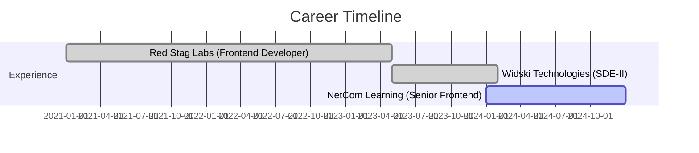

# 🚀 Basit Bilal Channa

<div align="center">
  
</div>

<p align="center">
  
</p>

<div align="center">
  
[](https://basit.dev)
[](mailto:bbchanna@gmail.com)
[](https://linkedin.com/in/basitchanna)
[](tel:+917006976393)

</div>

---

## 🌟 Professional Summary

```typescript
const BasitChanna = {
    role: "Senior Full Stack Developer",
    experience: "4+ Years",
    specialization: ["MERN Stack", "Microservices", "Team Leadership"],
    achievements: {
        applications_delivered: "50+",
        client_satisfaction: "95%",
        team_size_managed: "8+ developers",
        uptime_achieved: "99.9%"
    },
    current_focus: ["Digital Transformation", "Microservices", "Enterprise Solutions"]
};
```

---

## 💻 Tech Arsenal

<div align="center">

### 🎯 Frontend Mastery


### ⚡ Backend Excellence


### 🗄️ Database & Storage


### ☁️ Cloud & DevOps


### 🎨 UI/UX & Styling


</div>

---

## 🚀 Featured Projects

<div align="center">

### 🏆 AI CERTS365 - Blockchain Certificate Platform
[](https://github.com/basitbc)
[](https://basit.dev)

<div align="left">

**🎯 Project Overview:**  
Enterprise-grade blockchain certificate generation platform revolutionizing digital credentials for educational institutions across the GCC region.

**⚡ Key Features:**
- 🔐 **Tamper-Proof Certificates**: Smart contract integration ensuring 100% document authenticity
- 📊 **Massive Scale**: Serving 50+ educational institutions with 100,000+ certificates issued
- 🚀 **High Performance**: Processing 10,000+ daily API requests with sub-second response times
- 🌍 **Global CDN**: 70% latency reduction for international users
- 🐳 **Containerized Deployment**: Docker containers ensuring consistent environments

**🛠️ Technical Architecture:**
```
Frontend: Next.js + React.js + TypeScript
Backend: Node.js + Express.js + MongoDB
Blockchain: Smart Contracts + Web3 Integration
Infrastructure: Docker + Nginx + Azure Cloud
```

**📈 Business Impact:**
- ✅ **100% Document Authenticity** through blockchain verification
- ✅ **Zero Security Breaches** since deployment
- ✅ **50+ Institution Partnerships** across educational sector
- ✅ **99.9% Platform Uptime** maintaining service reliability

</div>

---

### 🤖 Marvel Minds - AI Job Portal Platform
[](https://github.com/basitbc)
[](https://basit.dev)

<div align="left">

**🎯 Project Overview:**  
Revolutionary AI-powered job matching platform connecting job seekers with opportunities using advanced machine learning algorithms and intelligent search capabilities.

**⚡ Key Features:**
- 🧠 **Smart Job Matching**: ML algorithms achieving 85% job match accuracy
- 🔍 **Lightning Search**: Elasticsearch enabling sub-second queries across 1M+ job listings
- 💰 **Revenue Generation**: Integrated premium features generating AED 500K+ monthly
- 🌐 **Multilingual Support**: Full Arabic and English localization
- 📱 **Mobile-First Design**: Responsive interface optimized for all devices

**🛠️ Technical Stack:**
```
Frontend: React.js + Redux Toolkit + Responsive Design
Backend: Node.js + Express.js + RESTful APIs
Database: MongoDB + Elasticsearch + Redis Caching
ML: Python + TensorFlow + Recommendation Engine
Payment: Stripe Integration + Subscription Management
```

**📊 Platform Metrics:**
- 👥 **50,000+ Active Users** across job seekers and employers
- 🎯 **1M+ Job Listings** with real-time updates
- ⚡ **Sub-second Search** response times with advanced filtering
- 💼 **85% Match Accuracy** through AI-powered recommendations
- 📈 **500K+ AED Monthly Revenue** from premium subscriptions

**🏆 Technical Achievements:**
- ✅ Built scalable microservices architecture handling high traffic
- ✅ Implemented real-time notifications using WebSocket connections
- ✅ Optimized database queries reducing response time by 60%
- ✅ Created comprehensive admin dashboard with analytics
- ✅ Integrated secure payment processing with fraud detection

</div>

---

### 🎬 AI Avatar & Audio Generator Platform
[](https://github.com/basitbc)
[](https://basit.dev)

<div align="left">

**🎯 Project Overview:**  
Cutting-edge multimedia platform combining AI voice synthesis, avatar animation, and intelligent chatbot capabilities for content creators and businesses.

**⚡ Advanced Features:**
- 🎙️ **Real-time Voice Synthesis**: High-quality AI voice generation with multiple accents
- 📹 **Avatar Animation**: Lifelike character animation synchronized with audio
- 🤖 **Smart Chatbot**: Intelligent conversational AI with context awareness
- 📊 **Analytics Dashboard**: Comprehensive usage statistics and performance metrics
- 🔄 **Real-time Processing**: WebSocket connections for live progress tracking

**🛠️ Advanced Architecture:**
```
Frontend: React.js + WebRTC + Real-time UI Updates
Backend: Node.js + Express.js + WebSocket Server
AI Processing: Python + TensorFlow + OpenAI APIs
Media Processing: FFmpeg + WebRTC + Stream Processing
Infrastructure: AWS Lambda + S3 + CloudFront CDN
Monitoring: Custom Analytics + Performance Tracking
```

**⚡ Performance Optimizations:**
- ☁️ **Serverless Computing**: AWS Lambda reducing operational costs by 60%
- 🎬 **Video Pipeline**: Handling 1,000+ concurrent video generation requests
- 📡 **Real-time Streaming**: WebSocket implementation for live updates
- 🚀 **CDN Integration**: Global content delivery with 99.9% availability
- 💾 **Smart Caching**: Redis implementation for frequently accessed content

**📈 Platform Statistics:**
- 🎬 **1,000+ Concurrent Requests** handled simultaneously
- ⚡ **60% Cost Reduction** through serverless architecture
- 📊 **Real-time Analytics** with custom dashboard
- 🌍 **Global Reach** with multi-region deployment
- 🔧 **99.9% Uptime** with automatic failover systems

**🏆 Innovation Highlights:**
- ✅ Pioneered real-time avatar animation with voice sync
- ✅ Implemented advanced AI models for natural speech generation
- ✅ Created scalable video processing pipeline with queue management
- ✅ Built comprehensive API ecosystem for third-party integrations
- ✅ Optimized for mobile devices with progressive web app features

</div>

</div>

---

## 💼 Professional Journey



### 🎯 Current Role: Senior Frontend Developer @ NetCom Learning
- 🏗️ **Architecture**: MERN stack solutions serving 100,000+ users
- 👥 **Leadership**: Managing multicultural team of 8 developers
- 📈 **Performance**: 40% faster load times, 25% user retention increase
- 🚀 **Impact**: 30% productivity improvement, 50% faster sprint velocity

---

## 🏆 Achievements & Impact

<div align="center">

| Metric | Achievement | Impact |
|--------|-------------|---------|
| 🎯 **Applications Delivered** | 50+ Production Apps | 95% Client Satisfaction |
| 👥 **Team Leadership** | 8+ Developers | 5 Nationalities |
| ⚡ **Performance Optimization** | 99.9% Uptime | 40% Faster Load Times |
| 📊 **API Development** | 50,000+ Daily Requests | Enterprise Scale |
| 🔄 **System Migration** | Monolithic → Microservices | 50+ RESTful APIs |
| 🌍 **Global Reach** | 70% Latency Reduction | CDN Implementation |

</div>

---

## 🎓 Education & Certifications

<div align="center">

**🎓 Bachelor of Engineering** - University of Mumbai (2019)  
*CGPA: 7.79/10*

**📚 Specializations:**
- Mathematical Principles & Data Analysis
- Project Management & Leadership
- Multidisciplinary Engineering Projects

</div>

---

## 🌐 Languages & Communication

<div align="center">


</div>

---

## 📫 Let's Connect & Collaborate!

<div align="center">

### 🤝 Open for collaborations on:
- 🚀 **Enterprise Web Applications**
- 🌩️ **Cloud-Native Solutions**
- 🤖 **AI/ML Integration Projects**
- 📱 **Mobile-First Experiences**

<br>

**💡 "Transforming ideas into scalable digital solutions, one line of code at a time!"**

<br>

[](https://github.com/basitbc)
[](https://github.com/basitbc)

</div>

---

<div align="center">
  
</div>

<div align="center">
  <sub>Built with ❤️ by <strong>Basit Bilal Channa</strong></sub>
</div>
