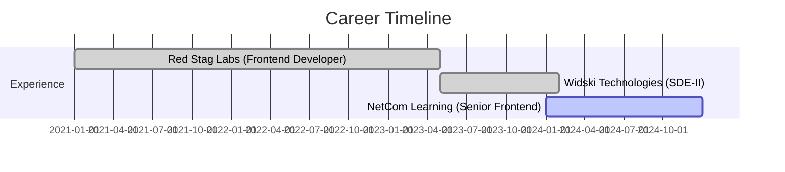

# 🚀 Basit Bilal Channa

<div align="center">
  
</div>

<div align="center">
  
[](https://basit.dev)
[](mailto:bbchanna@gmail.com)
[](https://linkedin.com/in/basitchanna)
[](tel:+917006976393)

</div>

---

## 🌟 Professional Summary

```typescript
const BasitChanna = {
    role: "Senior Full Stack Developer",
    experience: "4+ Years",
    specialization: ["MERN Stack", "Cloud Architecture", "Team Leadership"],
    achievements: {
        applications_delivered: "50+",
        client_satisfaction: "95%",
        team_size_managed: "8+ developers",
        uptime_achieved: "99.9%"
    },
    current_focus: ["Digital Transformation", "Microservices", "DevOps"]
};
```

## 💻 Tech Arsenal

<div align="center">

### 🎯 Frontend Mastery


### ⚡ Backend Excellence


### 🗄️ Database & Storage


### ☁️ Cloud & DevOps


### 🎨 UI/UX & Styling


</div>

---

## 📈 GitHub Analytics

<div align="center">
  
</div>

<div align="center">
  
</div>

---

## 🚀 Featured Projects

<div align="center">

### 🏆 AI CERTS365 - Blockchain Certificate Platform
[](https://github.com/basitbc)
[](https://basit.dev)

> **Enterprise-grade certificate generation platform serving 50+ institutions**
- 🔐 **Blockchain Integration**: Smart contracts for tamper-proof certification
- 📊 **Scale**: 100,000+ certificates issued, 10,000+ daily API requests
- 🛠️ **Tech Stack**: Node.js, Next.js, MongoDB, Docker, Azure
- ⚡ **Performance**: 70% latency reduction via CDN optimization

### 🤖 Marvel Minds - AI Job Portal
[](https://github.com/basitbc)
[](https://basit.dev)

> **AI-powered job matching platform with 50,000+ users**
- 🔍 **Smart Search**: Elasticsearch for sub-second queries across 1M+ listings
- 🎯 **ML Matching**: 85% improvement in job match accuracy
- 💰 **Revenue**: AED 500K+ monthly through premium features
- 🌐 **Multilingual**: Arabic & English support

### 🎬 AI Avatar & Audio Generator
[](https://github.com/basitbc)
[](https://basit.dev)

> **Multimedia platform with AI-powered content generation**
- 🎙️ **Voice Synthesis**: Real-time AI voice generation
- 📹 **Video Processing**: 1,000+ concurrent video requests
- ☁️ **Serverless**: AWS Lambda for 60% cost reduction
- 🔄 **Real-time**: WebSocket progress tracking

</div>

---

## 💼 Professional Journey



### 🎯 Current Role: Senior Frontend Developer @ NetCom Learning
- 🏗️ **Architecture**: MERN stack solutions serving 100,000+ users
- 👥 **Leadership**: Managing multicultural team of 8 developers
- 📈 **Performance**: 40% faster load times, 25% user retention increase
- 🚀 **Impact**: 30% productivity improvement, 50% faster sprint velocity

---

## 🏆 Achievements & Impact

<div align="center">

| Metric | Achievement | Impact |
|--------|-------------|---------|
| 🎯 **Applications Delivered** | 50+ Production Apps | 95% Client Satisfaction |
| 👥 **Team Leadership** | 8+ Developers | 5 Nationalities |
| ⚡ **Performance Optimization** | 99.9% Uptime | 40% Faster Load Times |
| 📊 **API Development** | 50,000+ Daily Requests | Enterprise Scale |
| 🔄 **System Migration** | Monolithic → Microservices | 50+ RESTful APIs |
| 🌍 **Global Reach** | 70% Latency Reduction | CDN Implementation |

</div>

---

## 🎓 Education & Certifications

<div align="center">

**🎓 Bachelor of Engineering** - University of Mumbai (2019)  
*CGPA: 7.79/10*

**📚 Specializations:**
- Mathematical Principles & Data Analysis
- Project Management & Leadership
- Multidisciplinary Engineering Projects

</div>

---

## 🌐 Languages & Communication

<div align="center">


</div>

---

## 📫 Let's Connect & Collaborate!

<div align="center">

### 🤝 Open for collaborations on:
- 🚀 **Enterprise Web Applications**
- 🌩️ **Cloud-Native Solutions**
- 🤖 **AI/ML Integration Projects**

<br>

**💡 "Transforming ideas into scalable digital solutions, one line of code at a time!"**

<br>

[](https://github.com/basitbc)
[](https://github.com/basitbc)

</div>

---

<div align="center">
  
</div>

<div align="center">
  <sub>Built with ❤️ by <strong>Basit Bilal Channa</strong></sub>
</div>
